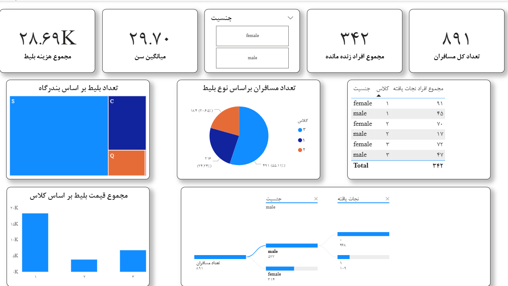

# 🚢 Titanic Survival Analytics Dashboard

یک داشبورد تحلیلی پیاده‌سازی شده در Power BI روی دیتاست تاریخی و مشهور تایتانیک. هدف از این پروژه، بررسی عوامل دموگرافیک (جنسیت، سن) و اقتصادی (کلاس بلیط) بر میزان زنده ماندن مسافران در این حادثه تاریخی است.

## 📊 شاخص‌های کلیدی (KPIs)
* **تعداد کل مسافران:** ۸۹۱ نفر
* **نجات‌یافتگان:** ۳۴۲ نفر (نرخ بقای حدود ۳۸٪)
* **میانگین سن مسافران:** ۲۹.۷ سال
* **مجموع درآمد حاصل از بلیط‌ها:** ~۲۸.۷ هزار دلار

## 💡 مهم‌ترین بینش‌های استخراج شده (Insights)

1. **الگوی طلایی بقا (Survival Patterns):** 
   تحلیل ماتریس داده‌ها نشان می‌دهد که جنسیت و کلاس مسافرتی دو عامل اصلی در زنده ماندن بوده‌‌اند. زنان حاضر در کلاس یک (Class 1) بیشترین نرخ نجات را ثبت کرده‌اند (۹۱ نفر).
2. **پارادوکس جمعیت و درآمد:**
   نمودارها نشان می‌دهند که بیش از ۵۵ درصد مسافران (۴۹۱ نفر) در کلاس ۳ (ارزان‌ترین کلاس) بوده‌اند، با این حال نمودار درآمدهای مالی ثابت می‌کند که کلاس ۱ به تنهایی بار اصلی درآمدزایی را بر دوش داشته است.
3. **تحلیل بندرگاه مبدأ (Embarkation Port):**
 مشخص شد که بندرگاه `S` (Southampton) نقطه سوار شدن اکثریت مطلق مسافران بوده است.

## 📸 نمای داشبورد

---
**نحوه اجرای فایل:**
برای مشاهده داشبورد، به نرم‌افزار Power BI Desktop نیاز دارید. فایل `Titanic_Dashboard.pbix` را از این مخزن دانلود کرده و اجرا کنید.
